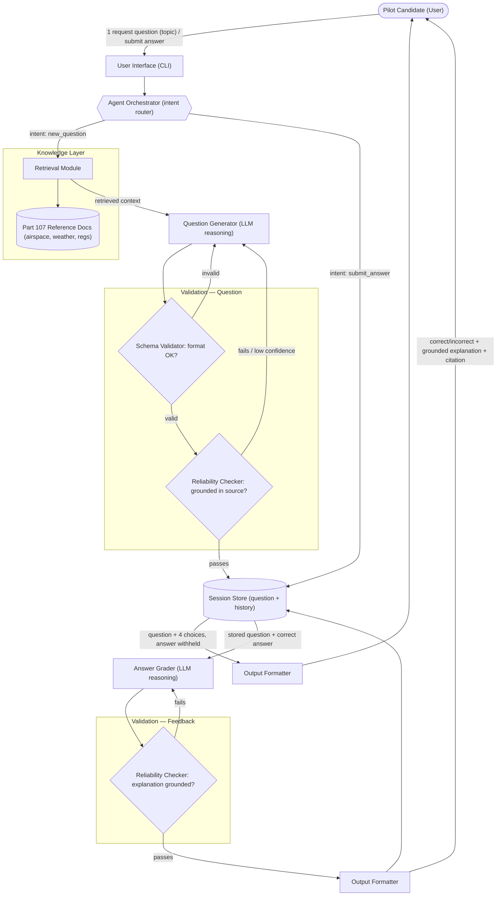

# FAA Part 107 Exam Prep Agent

An agent that generates FAA Part 107 (small drone) knowledge-test practice
questions and grades your answers, grounding every question and every piece
of feedback in a small retrieved reference set rather than the model's raw
recall.

## Origin & Goal

This is **not an extension of a specific Module 1–3 project** — no code was
carried over from any earlier assignment. The idea (an FAA Part 107 exam-prep
agent) was chosen fresh for this final capstone after considering a few
Module 1–3 candidates (e.g. the Module 3 Music Recommender Simulation) as
possible bases, none of which were ultimately extended. The original goal
was simply: build an agent that can generate multiple-choice FAA Part 107
practice questions and grade a candidate's answers, with retrieval-grounded
generation as the core AI technique, so the system's trustworthiness could
be demonstrated with validation and evaluation rather than taken on faith.

## What It Does

1. **Generate a question** — ask for a practice question on one of four
   topics (airspace, weather, operations, certification); the agent
   retrieves the relevant reference text, has an LLM draft a 4-choice
   question grounded in that text, and shows it to you (answer withheld).
2. **Grade an answer** — submit your choice; the agent tells you whether
   you were right, explains why with a citation back to the source
   document, and reports a running score.

Every generated question and every piece of feedback passes through
structural validation and a grounding check before it's shown to you — see
[Architecture](#architecture) below and
[model_card.md](model_card.md) for how and why that matters.

## Architecture



Both flows share the same shape: **retrieve → generate → validate → output**,
and a failed validation loops back to generation rather than reaching the
user. Full component legend and data-flow writeup:
[diagrams/architecture.md](diagrams/architecture.md).

## Setup

Requires Python 3.10+.

```bash
# 1. Clone/enter the project, create and activate a virtual environment
python -m venv .venv
source .venv/bin/activate        # Windows: .venv\Scripts\activate

# 2. Install dependencies
pip install -r requirements.txt

# 3. Configure your API key
cp .env.example .env
# then edit .env and set GEMINI_API_KEY to a real Gemini API key
# (get one at https://aistudio.google.com/apikey)
```

**Troubleshooting:**
- `ModuleNotFoundError: No module named 'google'` — you're not in the venv,
  or step 2 didn't run; re-activate the venv and re-run `pip install -r requirements.txt`.
- Running `python main.py` prints `[fatal] GEMINI_API_KEY environment variable
  is not set...` — step 3 wasn't done, or `.env` has the placeholder value
  still in it.
- You don't need a working API key at all to run the tests or the default
  (offline) evaluation — see below.

## Run

```bash
python main.py
```

Type `help` at the `>` prompt for the command list (`new [topic]`,
`a`/`b`/`c`/`d` to answer, `score`, `quit`). Logs are written to the console
(INFO+) and to `logs/agent.log` (DEBUG+, created on first run).

## Web UI

A browser-based alternative to the CLI, reusing the exact same `FAAAgent` /
`KnowledgeBase` / `GeminiClient` backend — **for local, single-machine use
only** (see [model_card.md](model_card.md)'s Misuse Prevention Measures:
this is not hardened for multi-user or public deployment).

Requires the same `.env` / `GEMINI_API_KEY` setup as the CLI (see Setup
above) — no extra configuration.

```bash
python webapp.py
```

Then open http://127.0.0.1:5000/ in a browser. `python webapp.py` fails
fast with the same `[fatal] ...` message as `main.py` if `GEMINI_API_KEY`
isn't set.

Pick a topic, click **New Question**, choose an answer, and see grounded
feedback plus a running score. Each browser tab gets its own independent
question/score (backed by its own `FAAAgent`/`SessionStore` server-side) —
opening a second tab doesn't affect the first — while both share the same
retrieval index and Gemini client underneath.

## Example Runs

The transcripts below are **real, executed output** — captured by actually
running `FAAAgent` through the same `print_question` / `print_feedback`
functions `main.py` uses. They run against the recorded fixture responses
from `evaluation.py` (`llm_client.MockClient`) rather than a live Gemini
call, since reproducing them doesn't depend on an API key; the code path
exercised — retrieval, generation, schema validation, grounding check,
session store, output formatting — is identical to a live run, only the
LLM's response text is a fixed recorded value instead of a fresh API call.

**Example 1 — request a new question:**

```
> new airspace

In which class of airspace may a remote pilot operate without prior ATC authorization?
  A. Class G
  B. Class B
  C. Class C
  D. Class D
(grounding confidence: 100/100)
```

**Example 2 — answer it correctly (continues the session above):**

```
> a

Correct! The correct answer is A.
Class G is uncontrolled airspace. A remote pilot may operate in Class G airspace without prior air traffic control (ATC) authorization.
Source: AIRSPACE.md
(feedback grounding confidence: 100/100)
Score: 1/1 correct (100%)
```

**Example 3 — request a topic with no matching reference material (error handling, not a crash):**

```
> new landing

[error] No reference material found for topic 'landing'.
```

## Test

No API key is required — the test suite (28 tests) exercises the full agent
loop against `llm_client.MockClient` instead of a live model:

```bash
pytest tests/ -q
```

## Evaluate

Produces a quantitative, structured report (retrieval hit rate + generation
reliability, confidence scores, attempts used) — see
[model_card.md](model_card.md) § Evaluation for what it measures and why.
No API key needed by default (runs against recorded fixture responses):

```bash
python evaluation.py            # writes eval_results.json + EVALUATION_RESULTS.md
python evaluation.py --live     # also exercises the real Gemini API (needs GEMINI_API_KEY)
```

## Testing Summary

- **28 automated tests, all passing** — unit tests for the schema validator
  and grounding checker (valid, malformed, wrong-citation, and hallucinated
  cases), end-to-end agent-workflow tests via `MockClient` (including a
  retry-after-failure case and a feedback-fallback case), a retrieval
  regression test against the real `docs/` folder, and 7 Flask route tests
  for the web UI (including session isolation between two browser tabs, an
  invalid-choice 400, and an unexpected-exception 500 via the global error
  handler).
- **Evaluation snapshot** (`EVALUATION_RESULTS.md`): 100% retrieval hit rate
  (4/4 topics routed to their expected source document), 100% generation
  success rate with 100/100 average confidence on accepted questions, and
  one topic (`weather`) deliberately taking 3 attempts to prove the retry
  loop and both validation layers reject bad output rather than the report
  being a trivial first-try pass.
- **One real bug the tests found**: an early grounding-checker design scored
  a fabricated claim as 100/100 "grounded" because generic connector words
  inflated its keyword-overlap ratio. Fixed by filtering common English
  function words before scoring overlap. See model_card.md § Unexpected
  Findings During Testing for the full account.

## Design Decisions

- **Keyword retrieval + keyword grounding, not embeddings.** With a
  four-document knowledge base, an embedding index would add a dependency
  (a vector store, an embedding API call) for no real retrieval-quality
  gain at this scale. The tradeoff — no semantic matching, vulnerable to
  paraphrase and incidental word overlap — is real and documented in
  model_card.md, but appropriate for the current scope.
- **Validate before showing the user anything, and loop back on failure**
  rather than showing a best-effort result with a caveat. A wrong practice
  question is worse than no question; `max_generation_attempts` bounds the
  retry cost.
- **Confidence score as a first-class output field**, not just an internal
  gate — surfacing the grounding score (`confidence_score` /
  `feedback_confidence_score`) lets a user (or grader) see *how* grounded an
  accepted answer is, not just that it passed some invisible internal
  threshold.
- **Typed exceptions internally, dict contract externally.** `errors.py`'s
  `RetrievalError` / `GenerationFailedError` / `NoActiveQuestionError` make
  the retry loop's control flow explicit and logged, while
  `new_question()` / `submit_answer()` still return the same
  `{"error": ...}` shape the CLI and tests expect — internal clarity
  without changing the public contract.
- **Gemini over Claude for `llm_client.py`**, to match the `google-genai`
  pattern already used in this course's Module 4 (docubot) and Module 5
  (bughound) starters, rather than introducing a second LLM provider and
  SDK into the codebase.
- **In-memory session store.** No database for a single-user CLI study
  tool — see model_card.md's Known Limitations for what this gives up
  (score history doesn't survive a restart).

## Project layout

| Path | Role |
|---|---|
| `docs/` | Part 107 reference material (the knowledge base) |
| `retrieval.py` | Chunking + keyword retrieval over `docs/` |
| `llm_client.py` | `GeminiClient` (real) / `MockClient` (for tests) |
| `schema_validator.py` | Structural check on generated questions |
| `reliability/grounding_checker.py` | Checks LLM output is actually grounded in retrieved text; scores confidence 0-100 |
| `faa_agent.py` | Orchestrator: routes `new_question` / `submit_answer`, retries on validation/grounding failure, surfaces confidence scores |
| `session_store.py` | In-memory current question + score |
| `prompts/` | System/user prompt templates |
| `main.py` | CLI entry point |
| `webapp.py` | Flask web UI entry point (app factory + routes); local-only alternative to `main.py` |
| `templates/index.html` | Web UI page shell |
| `static/style.css` / `static/app.js` | Web UI styling and vanilla-JS fetch logic |
| `errors.py` | Typed exceptions used internally by the agent |
| `logging_config.py` | Console + file logging setup |
| `evaluation.py` | Quantitative retrieval + generation-reliability evaluation harness |
| `EVALUATION_RESULTS.md` / `eval_results.json` | Latest evaluation snapshot (Markdown table + JSON) |

## Further Reading

- [model_card.md](model_card.md) — full design writeup: reliability layer,
  confidence scoring, known limitations, biases, misuse-prevention
  measures, and unexpected findings during testing.
- [reflection.md](reflection.md) — reflection on the AI-collaboration
  process during development.
- [diagrams/architecture.md](diagrams/architecture.md) — full data-flow
  writeup and component legend behind the diagram above.
