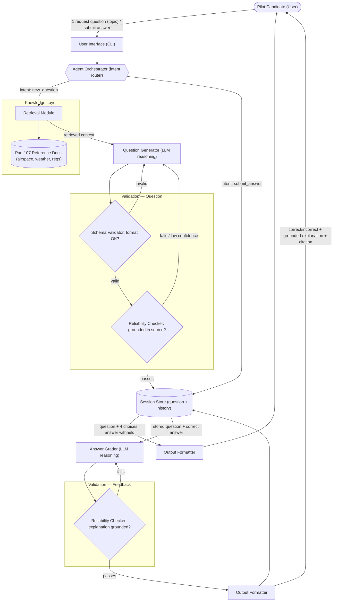

# System Architecture — FAA Part 107 Exam Prep Agent

## Core AI Feature

The system's core AI capability is an **agent** that (1) generates FAA Part 107
(Small Unmanned Aircraft) knowledge-test practice questions and (2) grades the
user's selected answer, grounding both actions in real Part 107 reference
material rather than relying on the LLM's unverified recall.

## Data Flow: Input → Processing → Validation → Output

There are two request types the agent handles; both pass through the same
generate/validate/output shape.

### Flow A — Request a new question

1. **Input** — user asks for a question, optionally naming a topic
   (e.g. airspace classification, weather minimums, loading & performance,
   right-of-way rules).
2. **Processing** —
   - the Agent Orchestrator classifies the intent as `new_question`
   - the Retrieval Module pulls the relevant chunk(s) from the Part 107
     Knowledge Base (regulation text, airspace/weather reference docs)
   - the Question Generator (LLM reasoning step) drafts a 4-choice
     multiple-choice question from that retrieved context, including the
     correct answer, an explanation, and a citation back to the source chunk
3. **Validation** —
   - Schema Validator checks the question has exactly one correct answer,
     four non-empty choices, and a citation; malformed output loops back to
     the Question Generator
   - Reliability Checker (grounding check) confirms the stated correct answer
     and explanation are actually supported by the retrieved text, not
     hallucinated; a failed check also loops back to the Question Generator
4. **Output** — the validated question and four choices are shown to the
   user; the correct answer is withheld and stored server-side in the
   Session Store.

### Flow B — Submit an answer

1. **Input** — user selects a choice (A/B/C/D) for the currently displayed
   question.
2. **Processing** —
   - the Agent Orchestrator classifies the intent as `submit_answer`
   - the Session Store returns the stored question, correct answer, and
     citation
   - the Answer Grader (LLM reasoning step) compares the user's choice to the
     correct answer and drafts feedback text explaining why
3. **Validation** — the Reliability Checker re-verifies the feedback
   explanation is grounded in the cited source before it is shown; ungrounded
   feedback loops back to the Answer Grader for revision.
4. **Output** — a correct/incorrect verdict, the grounded explanation, and
   the regulation citation are returned to the user; the Session Store logs
   the result to the running score/history.

## Architecture Diagram

## Component Legend

| Component | Role |
|---|---|
| User Interface | Captures topic requests / answer submissions, displays questions and feedback |
| Agent Orchestrator | Routes each input to the `new_question` or `submit_answer` path |
| Retrieval Module | Fetches relevant Part 107 reference text for a given topic (grounding source) |
| Question Generator | LLM step that drafts a question, choices, answer, and explanation from retrieved context |
| Answer Grader | LLM step that compares the user's choice to the correct answer and drafts feedback |
| Schema Validator | Structural check — one correct answer, four choices, citation present |
| Reliability Checker | Grounding check — confirms answers/explanations are supported by the cited source, not hallucinated |
| Session Store | Holds the active question, correct answer, and running score/history |
| Output Formatter | Shapes the final question or feedback for display to the user |
